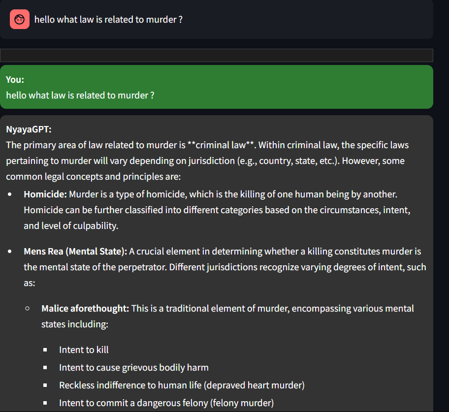
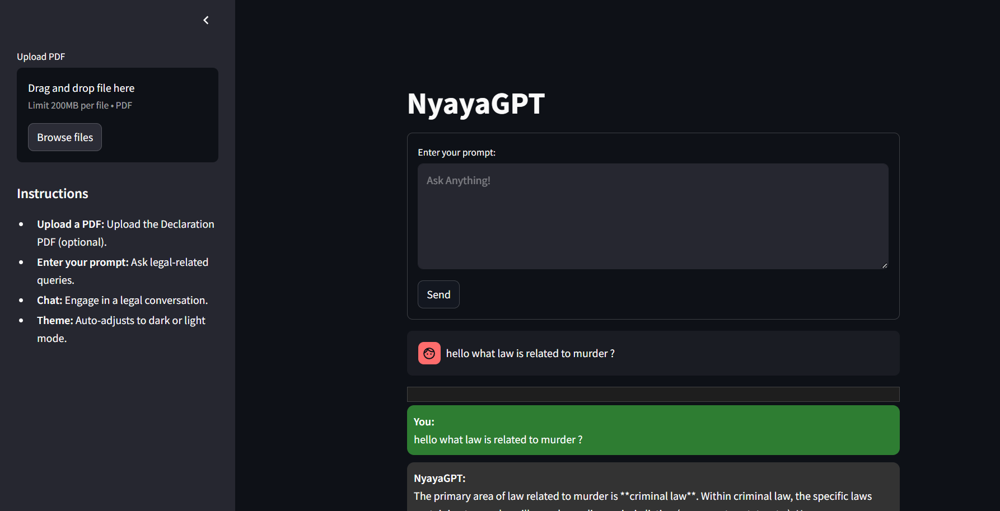

# NyayaGPT - AI Legal Assistant for Indian Law ⚖️

<div align="center">
  
  
  
</div>

## 📌 Overview
NyayaGPT is an AI-powered legal assistant specializing in Indian law, combining:
- **PDF document analysis** (RAG system)
- **Pre-trained Indian Penal Code (IPC) knowledge**
- **Gemini-powered legal reasoning**

## 📸 Screenshots

<div align="center">
  <figure>
    
    <figcaption>Fig 1. Chat Interface</figcaption>
  </figure>

  /n
  
  <figure>
    
    <figcaption>Fig 2. Document Analysis</figcaption>
  </figure>
</div>

## 🚀 Features

| Feature | Description |
|---------|-------------|
| 📄 **PDF Intelligence** | Analyze uploaded legal documents with pinpoint accuracy |
| ⚖️ **IPC Expert** | Built-in knowledge of 511 IPC sections (updated 2023) |
| 🔍 **Hybrid Search** | Combines semantic + keyword search for best results |
| ✨ **Professional Formatting** | Responses include sections, punishments, and case references |
| 🎨 **Theme Support** | Auto-adjusts for light/dark mode |

## 🛠️ Installation

### Prerequisites
- Python 3.9+
- Google API key (for Gemini)

### Steps
create .env file 
add your gemini key like this 
GOOGLE_API_KEY = "Your_api_key"

```bash
# Clone repository
git clone https://github.com/yourusername/nyayagpt.git
cd nyayagpt

# Install dependencies
pip install -r requirements.txt

